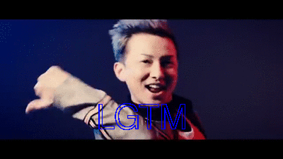

# issagen
Issa Generator

```
$ issagen "LGTM"
```

**=> issagen.gif file is generated.**



## Installation

### macOS

```
$ brew tap greymd/tools
$ brew update
$ brew install issagen
```

### RHEL compatible distros:

```
$ sudo yum install https://github.com/greymd/issagen/releases/download/v1.0.0/issagen-v1.0.0.rpm
```

### Debian base distros:

```
$ wget https://github.com/greymd/issagen/releases/download/v1.0.0/issagen-v1.0.0.deb
$ sudo dpkg -i issagen-v1.0.0.deb

!! If you found errors, run this command
$ sudo apt -f install
```


## Usage

```
Usage:
  issagen [OPTIONS] [message]

Description:
  Issa Generator.
  Generate issagen.gif on the current directory.

OPTIONS:
  -h,--help   Show this screen.
  -f          Specify font name (i.e, Arial, Times) or path of ttc/ttf file.
  -s          Silent mode (Do not open image viewer).
```

## Example

```
$ issagen -f /Library/Fonts/AppleGothic.ttf 表へ出ろ
```

