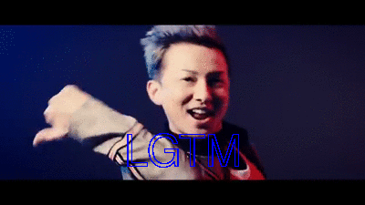

# issagen
Issa Generator

```bash
$ issagen "LGTM"
```

**=> issagen.gif file is generated.**



## Installation

### macOS

```bash
$ brew tap greymd/tools
$ brew update
$ brew install issagen
```

### RHEL compatible distros:

```bash
$ sudo yum install -y ImageMagick
$ sudo yum install -y https://git.io/issagen.rpm
```

### Debian base distros:

```bash
$ sudo apt install imagemagick wget
$ wget https://git.io/issagen.deb
$ sudo dpkg -i issagen.deb
```


## Usage

```
Usage:
  issagen [OPTIONS] [message]

Description:
  Issa Generator.
  Generate issagen.gif on the current directory.

OPTIONS:
  -h,--help   Show this screen.
  -f          Specify font name (i.e, Arial, Times) or path of ttc/ttf file.
  -s          Silent mode (Do not open image viewer).
```

## Example

```
$ issagen -f /Library/Fonts/AppleGothic.ttf 表へ出ろ
```
